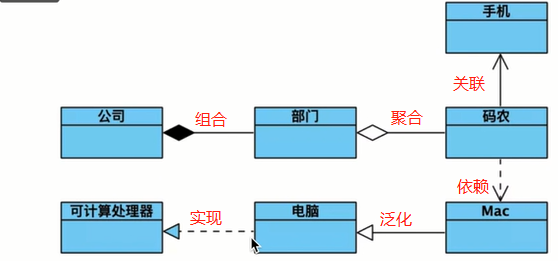
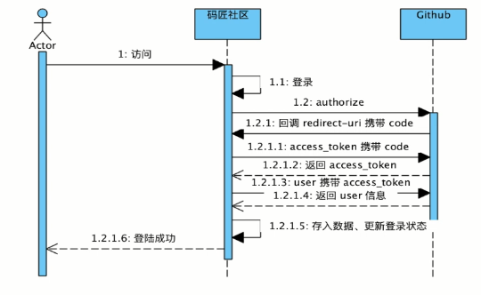

## 日天社区
主要做：问题、资料、资源平台
## 目的
SpringBoot
SpringMVC
Mybatis
MySQL、H2
Flway
Heroku
Git/Github
Maven
Restful

## 资料
[spring官网](https://spring.io/guides)
---
[elasticsearch社区](https://elasticsearch.cn/)
- - -
[Bootstrap](https://v3.bootcss.com/)
***
[Github OAuth](https://developer.github.com/apps/building-oauth-apps/creating-an-oauth-app/)
* * *
[创建OAuth App](https://developer.github.com/apps/building-github-apps/identifying-and-authorizing-users-for-github-apps/)
1. 调用github的authorize获取授权,回调redirect_url为申请app时的url(携带code)
` GET https://github.com/login/oauth/authorize `
2. github跳转回来的地址会携带code参数,自己写一个api接受code,同时用服务端模拟post请求调用access_token,入参为code,出参为access_token
` POST https://github.com/login/oauth/access_token `
3. 通过access_token签名再次调用github的一个API,就可以拿到具体的用户信息
` Authorization: token OAUTH-TOKEN
  GET https://api.github.com/user `
___
+ 泛化关系 is-a 继承于非抽象类
+ 实现关系      继承抽象类
+ 聚合关系   码农与部门
+ 组合关系   部门与公司
+ 关联关系   被关联者属于关联者的一部分,手机是码农的一部分,程序里以类变量的方式表现
+ 依赖关系   表示一个对象在运行期间会用到另一个对象的关系。码农在工作的时候才会用到电脑,程序里通过构造函数、形参等体现
+ 实箭泛化虚实现,虚线依赖实关联,空菱聚合实组合

---

+ 
+ 


## 工具
[Visual Paradigm](https://www.visual-paradigm.com)
[OK Http](https://square.github.io/okhttp/)

##脚本
```sql
CREATE TABLE user
(
    id int AUTO_INCREMENT PRIMARY KEY,
    name varchar(50),
    accouny_id varchar(100),
    token char(36),
    gmt_create bigint,
    gmt_modified bigint
);
```